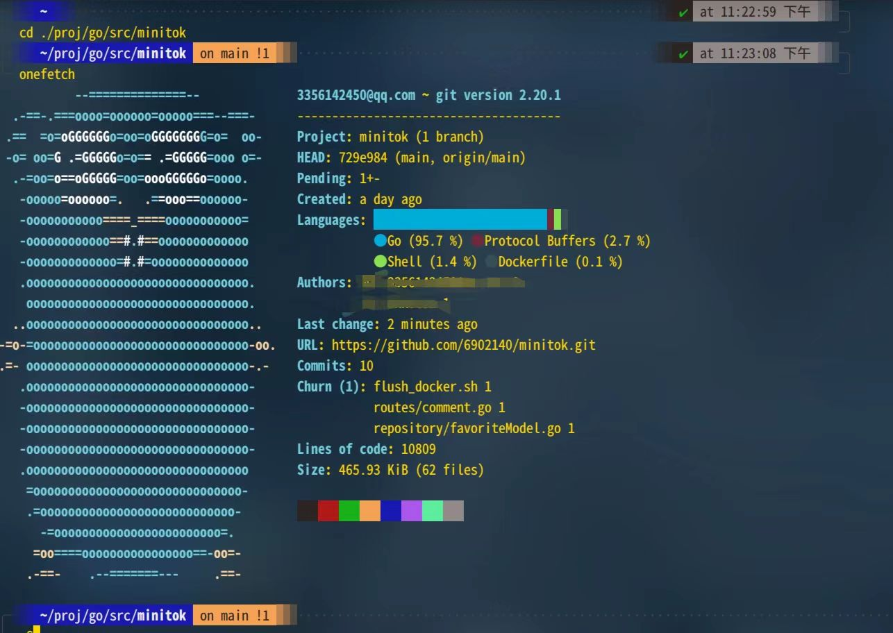
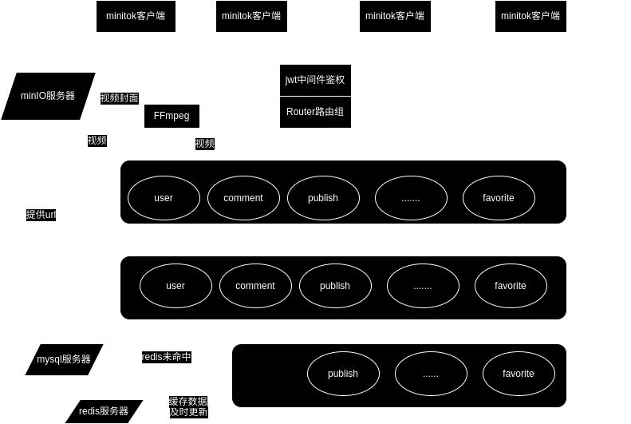

#  第六届字节跳动青训营`minitok`低配抖音项目

基于`gorm`框架+`gin`http框架+`grpc`微服务框架 使用`docker`进行快速部署的低配版抖音项目：

### 主要技术框架及配置：

- ORM框架 `gorm`
- http框架 `gin`
- 数据库 `mysql` `redis`
- 分布式对象存储 `minio`
- 配置解析 `viper`
- 日志管理 `zap`
- 项目部署 `docker` `docker-compose`
- 其他工具 `FFmpeg`

项目概览：

### 快速上手启动：
准备好linux环境

首先配置好`docker`以及`docker-compose`;

然后使用命令`sudo docker-compose up`快速构建部署运行项目

(如果项目没有出现`[GIN-debug] Listening and serving HTTP on :8080)`建议重新运行`sudo docker-compose up`指令

### 项目架构介绍

由于本人之前没有接触过`golang`开发的项目，反而对`java`更加熟悉，所以本项目的架构主要借鉴了
传统的`MVC`三层架构，也就是对应的：
也就是：

- 控制层（Handler）：用于控制网络请求。

- 业务层（Service）：用于处理具体业务，还有简单的数据库操作。

- 持久层（Dao）：用于进行数据库的操作。

数据库设计图示：

###  实现功能

| 功能    | 说明 | 是否实现 |
|-------| ------- |--|
| 基础功能  | 视频feed流、视频投稿，个人信息、用户登录、用户注册|  ✔ |
| 扩展功能1 | 视频点赞/取消点赞，点赞列表；用户评论/删除评论，视频评论列表| ✔ |
| 扩展功能2 | 用户关注/取关；用户关注列表、粉丝列表| ✔ |

未来可改进方向：
