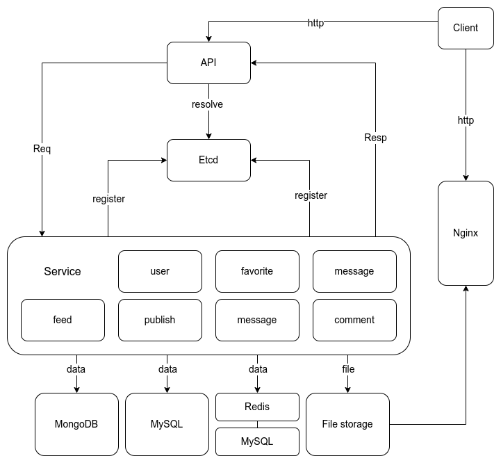

一、项目介绍
项目简介：高仿版抖音app的服务端实现，名为minitok，此项目采用微服务架构，完成度高，完成了所有基本功能和两个拓展方向的功能。
项目服务地址：http://103.146.231.207:8080
项目地址：https://github.com/6902140/minitok.git

| 成员  | 分工            | 是否完成 |
|-----|---------------|------|
| 肖追日 | 整体架构规划，确保项目进度 | ✔    |
| 黄依婷 | 鉴权            | ✔    |
| 彭健垚 | 喜欢，评论         | ✔    |
| 潘弘毅 | 用户信息          |✔ |
| 李洋阳 | 视频投稿和发布       |✔ |

项目技术栈介绍
- 本项目使用Go语言开发，采用了字节跳动开源的微服务RPC框架Kitex和HTTP框架Hertz实现的微服务架构；
- 本项目使用MySQL、Redis以及MongoDB作为数据库支持，并且使用ETCD实现微服务的发现与注册；
- 此外本项目还使用到了viper、gorm、jaeger等第三方库以及使用nginx提供文件访问服务。
- 使用参数化查询来构造SQL代码，不使用字符串拼接，避免SQL注入
- 引入JWT认证，进行全局TOKEN管理，进行无状态认证，降低了服务器的负担，同时还保有灵活性，可拓展性以及跨域和跨平台支持
- 使用redis的同步锁机制，防止多个线程同时修改一处数据
- 用户密码安全存储，基于Blowfish密码算法的密码哈希函数，具有单向不可逆的特性，返回用户基本信息时进行脱敏。

架构示意图

数据库设计图示：

